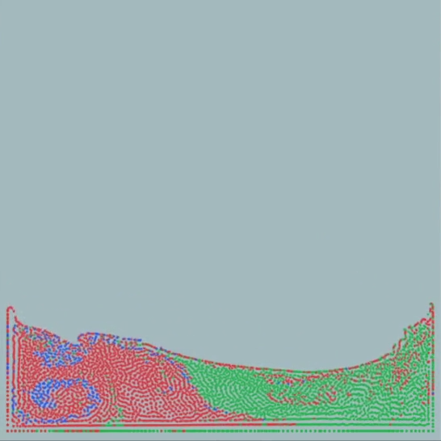
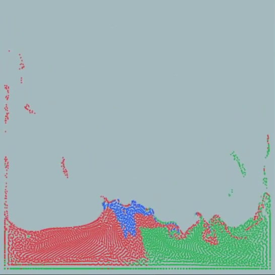

# Fluid Simulation - PCISPH

A course project of "Principles and Algorithm of Computer Animation (计算机动画原理与算法)" of CS, Tsinghua University]

The `particle_system.py` and `sph_base.py` are adopted from [taichiCourse01/taichi_sph](https://github.com/taichiCourse01/taichi_sph).

## Results

<table>
    <tr>
    	<th>viscosity</th>
        <th>screenshot</th>
        <th>video</th>
    </tr>
    <tr>
    	<td>0.00</td>
        <td></td>
        <td><video><source src="assets/0_00.mp4" type="video/mp4"></video></td>
    </tr>
    <tr>
    	<td>0.05</td>
        <td></td>
        <td><video><source src="assets/0_05.mp4" type="video/mp4"></video></td>
    </tr>
    <tr>
    	<td>0.20</td>
        <td></td>
        <td><video><source src="assets/0_20.mp4" type="video/mp4"></video></td>
    </tr>
</table>
